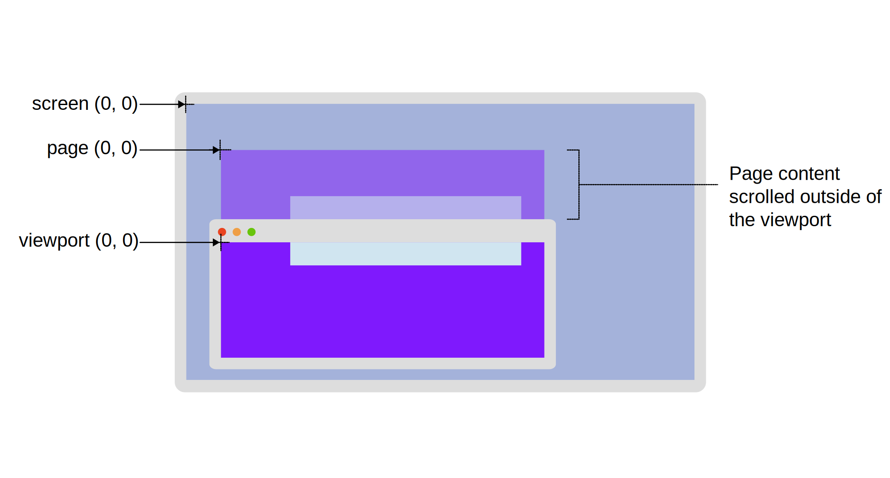

<style>
  .blue { color: #1589F0; }
  .red { color: #f03c15; }
  .yellow { color: #e3b312; }
  .font {font-size: 16px;}
  .weight {font-weight: 700;}
</style>

<!-- <span class=""></span> -->

<h3>1. Prefer not to use var because of issue in block scope and functional scope</h3>

<h3>
2. "use strict"; --> treat all JS code as newer version
</h3>
<h3>
3. NaN --> Not a number
</h3>

<h3>
4. about random in JS
</h3>

```javascript
console.log(Math.random());
console.log(Math.floor(Math.random()*10) + 1);

const min = 10
const max = 20

console.log(Math.floor(Math.random() * (max - min + 1)) + min);
```


<h3>
5. Function Declartion
</h3>

```javascript
function addone(num) {
    return num + 1
}//function 

addone(5)

--------------------------------------

const addTwo = function(num) {
    return num + 2
}//it is also function but we called as expression

addTwo(5)
```
<h3>
6. 
</h3>

`this keyword` we can use in object not in function

<h3>
7. Arrow function
</h3>

```javascript
const addTwo = (num1, num2) => {
    return num1+num2
}
```

* <span class="red">An explicit return is when you explicitly write the word return in the function. To do an implicit return, remove the word return , then move what you are returning up to the same line as the rest of the function. You can remove the curly brackets.</span>

* Note:-

```javascript
const addTwo = function(num) {
    return num + 2
}//it is also function but we called as expression, means it is an expression
```

<h3>
8. Immediately Invoked Function Expressions (IIFE)
</h3>

```javascript
(function chai() {
    console.log(`DB connected`);
})()
```
* <span class="yellow">To remove the pollution of global scope variables</span>

* <span class="yellow">first () for function defination and second () for execution</span>

* <span class="yellow">make sure to end the execution of IIFE using ';' after 2nd ()</span>

<h3>
9. JS execution context
</h3>

* <span class="red font"><b>Gloabal execution context</b></span>

* <span class="red font"><b>Function execution context</b></span>

* <span class="red font"><b>eval execution context</b></span>


1.`global execution-> this`

2.`memory creation phase`

3.`execution phase`


* memory phase-> e.g code:

    ```javascript
    let val1 = 10
    let val2 = 5
    function addNum(num1, num2){
    let total = num1+ num2
        return total
    }
    let result1 = addNum(val1, val2)
    let result2 = addNum(10, 2)
    ```

    `val1=>undefinded`

    `val2=>undefinded`

    `addNum=>defination`

    `result1=>undefinded`

    `result2=>undefinded`<br><br>

* execution phase

    val1 <- 10 <BR>
    val2 <- 5 
    
    <image src="hi.PNG">

    * <span class="yellow">Google Tag Manager provides a feature called Sandboxed JavaScript, which allows you to execute JavaScript code in a <span class='red font weight'>sandboxed</span> environment. This means that the code is executed in a restricted environment, where it cannot access the global scope or manipulate the global namespace</span>


<h3>
10. Nullish coalescing operator(??):
</h3>

```javascript
let val1;
val1 = 5 ?? 10
val1 = null ?? 10
val1 = undefined ?? 10
val1 = null ?? 10 ?? 20 //first value jayegi jo sahi he
```

* <span class="blue"> if there is null or undefined value than it not take that. it used in data base when we take some data from data base and that time if some data is null or undefined that time it is useful </span>


<h3>
11. map
</h3>
 
* just like dictionary in python.

```javascript
const map = new Map()
map.set('IN', 'India')
map.set('USA', 'United States of America')
map.set('Fr', 'France')
map.set('IN', 'India')
```

<h3>
12. for of loop
</h3>

```javascript
const arr = [1,2,3,4,5]

for (const num of arr) {
    console.log(num);    
}
```
* <span class="yellow"> we can not iteret through object using for of loop but we can iteret over `map`</span>

* <span class="red">Example</span>

```javascript
console.log(map);

for (const [key, value] of map) {
    console.log(key, ':- ', value);
}//also work for the array
```

<h3>
13. for in loop
</h3>

```javascript 
const myObject = {
    js: 'javasctipt',
    cpp: 'C++',
    rb: 'ruby',
    swift: "swift by apple"
}

for (const key in myObject) {
    console.log(`${key} shortcut is for ${myObject[key]}`);
}
```
* <span class="blue">we can also use for in loop to iterate array and map.</span>

<h3>
14. forEach loop
</h3>

```javascript
const coding = ["js", "ruby", "java", "python", "cpp"]

coding.forEach(  function (val) {
    console.log(val);
})
```

* forEach() loop is not return anything


----------------------------------------------------------------------
## DOM ):-
---
<span class="yellow">The Document Object Model (DOM) is a programming interface for HTML(HyperText Markup Language) and XML(Extensible Markup Language) documents. It defines the logical structure of documents and the way a document is accessed and manipulated.</span>

* So basically Document Object Model is an API that represents and interacts with HTML or XML documents.

* The DOM is a W3C (World Wide Web Consortium) standard and it defines a standard for accessing documents.

    * `The W3C Dom standard is divided into three different parts:`

        <span class="red">1. Core DOM – standard model for all document types </span> <br>
        <span class="blue"> 2.XML DOM – standard model for XML documents</span> <br>
        <span class="yellow">3.HTML DOM – standard model for HTML documents</span>  <br>

```
DOM is basically the representation of the same HTML document but in a tree-like structure composed of objects. JavaScript can not understand the tags<P>H</P>in HTML document but can understand object P in DOM.
```

* Why DOM is called an Object Model?

    * Documents are modeled using objects, and the model includes not only the structure of a document but also the behavior of a document and the objects of which it is composed like tag elements with attributes in HTML.


---

1.document.getElementById('')<br>
2.document.getElementById('').class --> undefined <br>
3.document.getElementById('').className <br>
4.setAttribute('class', 'test') <br>
5.title.textContent<br>
6.title.innerHTML<br>
7.title.innerText<br>
8.document.querySelector('h2')
---

### Difference b/w textContent and innerText

* `textContent` show the whole content inside the element, let say if in h1 there is a span tag and the style of span tag is display none then and then it show the hidden content

* `innerText` don't show the hidden content

* <span class="red"> `NOT:-` But it allways depend upon the usecase if you want to change the thing that are easily seen that time use the innerText otherwise textContent</span>

* `innerHtml` shows the html content inside selected element -> span tag inside the h1 tag

---

* `document.querySelector('h2')` --> it only select the first element

```
for id -> document.querySelector('#title')
for class -> document.querySelector('.heading')
```

* `document.querySelectorAll('h2')` --> it selects all the element

---

# Events ):-

<span class="yellow">
The addEventListener() is an inbuilt function in JavaScript which takes the event to listen for, and a second argument to be called whenever the described event gets fired. Any number of event handlers can be added to a single element without overwriting existing event handlers. 
</span>

### Event bubbling
* Event bubbling is a method of event propagation in the HTML DOM API when an event is in an element inside another element, and both elements have registered a handle to that event. It is a process that starts with the element that triggered the event and then bubbles up to the containing elements in the hierarchy. In event bubbling, the event is first captured and handled by the innermost element and then propagated to outer elements.

* `addEventListener(type, listener, useCapture)`

* type: Use to refer to the type of event.
* listener: Function we want to call when the event of the  specified type occurs.
* userCapture: Boolean value. The boolean value indicates the event phase. By Default useCapture is false. It means it is in the bubbling phase.

* bubbling => inside to outside
* `stopPropagation()` to prevent bubbling it not goes outside means it no goes to the parent element => stop bubbling up

* The `preventDefault()` method is used to prevent the browser from executing the default action of the selected element. It can prevent the user from processing the request by clicking the link.

* `target` in event means from where it comes. it shows the selected html element and its content

* `tagName` if we want the parent element we can use tageName just like `target`.

    example:-
     ```javascript
        document.querySelector('#images').addEventListener("click", (e) => {
		// console.log(e.target.tagName);
		if(e.target.tagName == 'IMG') {
			// console.log(e.target.id)
			let removIt = e.target.parentNode
			removIt.remove()//this and below line is same
			// removIt.parentNode.removeChild(removIt)
		}
	}, true)
     ```

* `setTimeout()`  method sets a timer which executes a function or specified piece of code once the timer expires.

* `clearTimeout()` method cancels a timeout previously established by calling setTimeout(). <span class="red">If the parameter provided does not identify a previously established action, this method does nothing.</span>

* `currentTarget`  identifies the element to which the event handler has been attached. <span class="yellow"> means events like "click" and etc. if we want to know on wich attribute or on which element the evnet is attached or add we can use currentTarget.</span>

* `altkey, ctrlkey, shiftkey,` are for  to ensure that that respective key is pressed or not on mouseEvent like click, mousemove etc. and it return boolean value true if it is pressed and false if not.

* `clientX & clientY` this is location of our cursor in cordinate system just like x and y axis but it measure the cordinate from pixels. clientX and clientY is for viewPort screen means our website screen, the area where website is visible.

* `screenX & screenY` this is also indicate the cursor location  but it is for whole webpage mean entire browser.


    

---

## Asynchronous programming

* Asynchronous programming is a technique that enables your program to start a potentially long-running task and still be able to be responsive to other events while that task runs, rather than having to wait until that task has finished. Once that task has finished, your program is presented with the result.


<h3>What we need is a way for our program to:</h3>

1. Start a long-running operation by calling a function.
2. Have that function start the operation and return immediately, so that our program can still be responsive to other events.
3. Have the function execute the operation in a way that does not block the main thread, for example by starting a new thread.
4. Notify us with the result of the operation when it eventually completes.

* That's precisely what asynchronous functions enable us to do